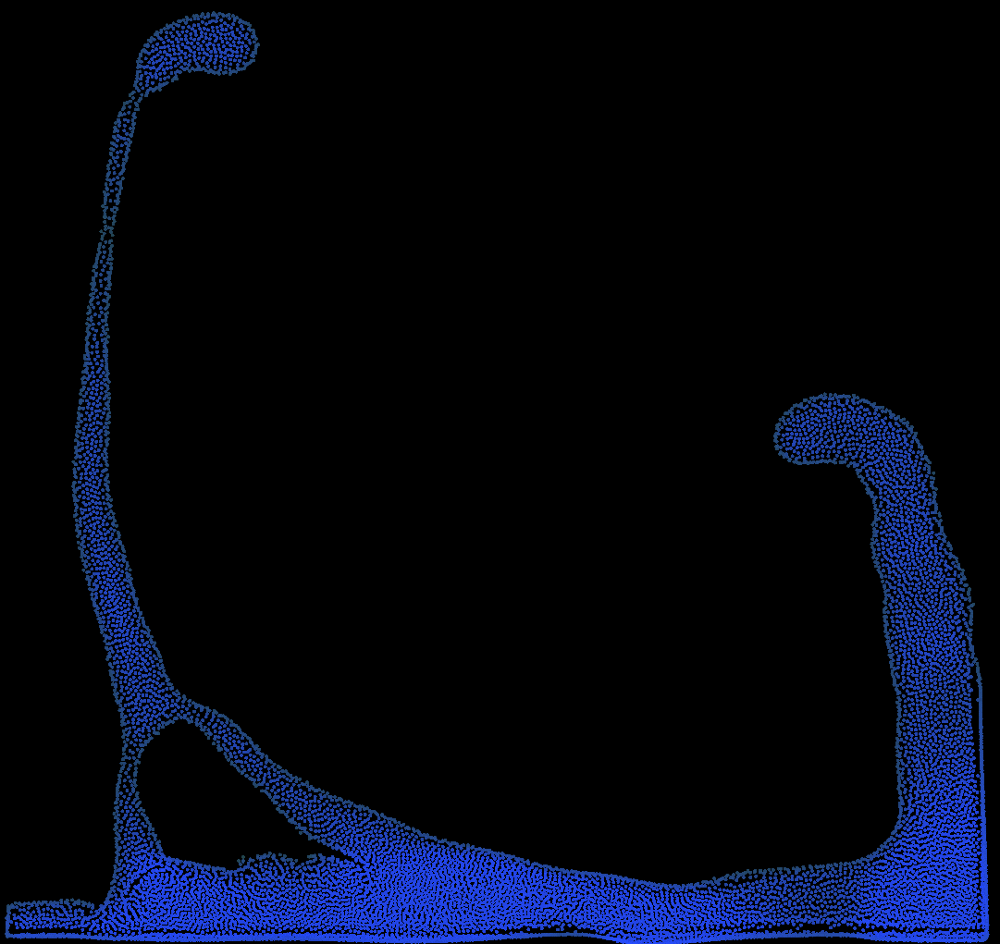

# SPH 2D Water Simluation

__Project creation date:__ 23.05.2018

## Description
This project simulates fluids in 2D with a particle-based viscoelastic simulation.\
The fluid simulation is executed on the GPU with OpenCL for better performance.

## Technologies
* C#
* MonoGame
* OpenCL

## Remarks
The simulation is based on the following paper:\
http://www.ligum.umontreal.ca/Clavet-2005-PVFS/pvfs.pdf

## Pictures

***

